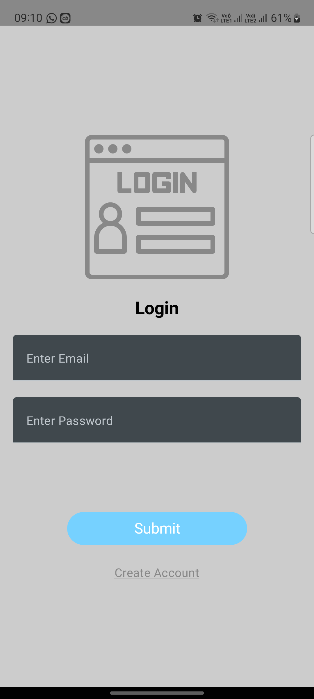
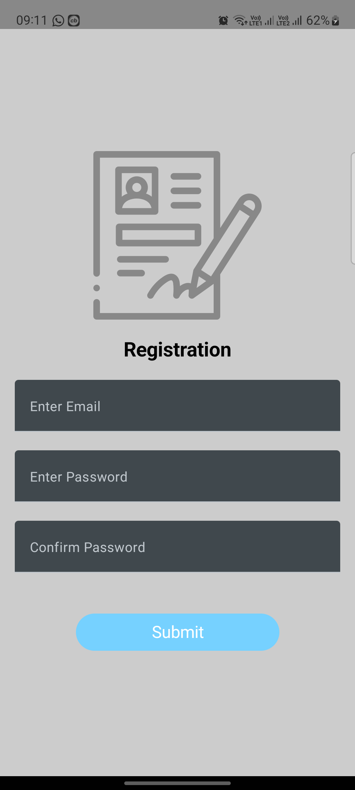
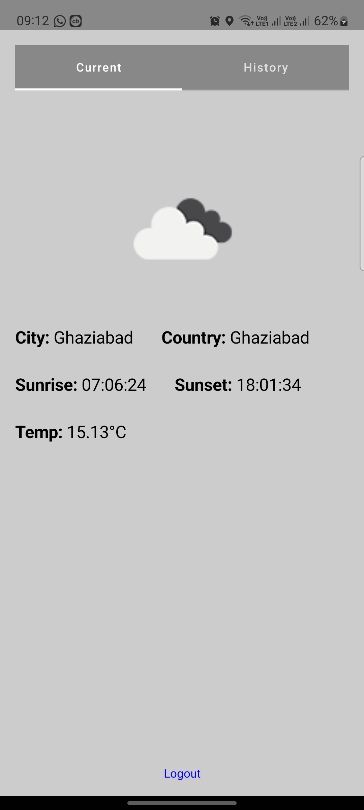
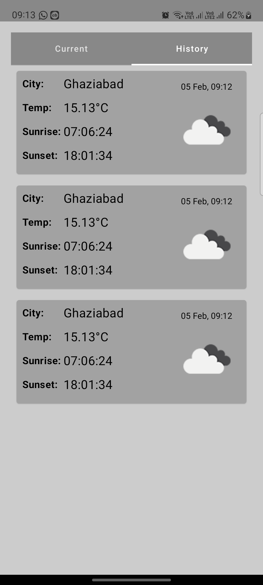

# WeatherAssignment
WeatherAssignment is an Android application built using Kotlin and designed with MVVM Clean architecture. The app utilizes HILT for dependency injection, Compose for UI, Room for local database storage, Fused Location API for obtaining the current location, and the OpenWeatherMap API for fetching weather information. It also incorporates a Splash Screen API for a smooth startup experience.

## Features
### MVVM Clean Architecture: 
The application follows the MVVM architectural pattern with Clean Architecture principles, ensuring separation of concerns and maintainability.

### Dependency Injection with HILT: 
HILT is employed for dependency injection, facilitating the management of dependencies and promoting modularity.

### Compose for UI: 
The UI is implemented using Jetpack Compose, providing a declarative and modern approach to building user interfaces.

### Room Database: 
Room is used for local database storage, allowing the app to persistently store weather information and user data.

### Fused Location API: 
The Fused Location API is utilized to determine the device's current location, enhancing the accuracy of weather data.

### OpenWeatherMap API: 
The OpenWeatherMap API is integrated to fetch current weather information based on the device's location.

### Splash Screen API: 
A Splash Screen is implemented to enhance the user experience during app startup.

### Login and Registration: 
The application includes screens for user login and registration, with local Room database storage for user credentials.

### Compose Navigation: 
Navigation within the app is managed using Compose Navigation, providing a seamless flow between screens.


## Dependencies
- HILT
- Jetpack Compose
- Room Database
- Fused Location Provider
- OpenWeatherMap API
- Retrofit
- JUnit
- Kluent
- Mockito

## Unit Test
This repository provides a comprehensive unit testing setup for Android applications using JUnit, Mockito, and Kluent. The testing framework is designed to ensure the reliability, correctness, and maintainability of the application codebase.

### Key Components
### JUnit
JUnit is a widely used testing framework for Java and Kotlin applications. It provides annotations for defining test methods, assertions for validating expected outcomes, and test runners for executing the tests.

### Mockito
Mockito is a powerful mocking framework for Java and Kotlin. It allows the creation of mock objects to simulate dependencies, enabling isolated unit testing. Mockito works seamlessly with JUnit to facilitate effective testing of individual components.

### Kluent
Kluent is a fluent assertion library for Kotlin. It simplifies the process of writing assertions by providing a clear and concise syntax. Kluent enhances the readability of tests and promotes expressive assertions.

## Getting Started
Clone the repository: git clone https://github.com/saurabhpere/MyWeatherApp

Open the project in Android Studio.

## Adding API Key to `native-lib.cpp`
To integrate your API key you need to put OpenWeatherMap api key in base64 form into the `native-lib.cpp` file, follow these steps:
1. Open the `cpp/native-lib.cpp` file in your preferred text editor.
2. Locate the section where the API key needs to be added.
3. Replace the placeholder `BASE64_API_KEY_HERE` with your actual API key encoded in base64.
4. Save the changes to the `native-lib.cpp` file.
```cpp
// cpp/native-lib.cpp

std::string api_key = "BASE64_API_KEY_HERE"; // Replace with your actual API key in base64
// ...
```

Build and run the app on an emulator or physical device.

## Screens
### Login:
Allows users to log in with their credentials.


### Registration:
Enables users to create a new account by providing the necessary registration details.


### Home - Tab 1 (Current Weather):
Displays the current weather information based on the device's location obtained through Fused Location API and OpenWeatherMap API.


### Home - Tab 2 (History Listing):
Shows a listing of weather history saved in the local Room database.



## Contributing
Feel free to contribute to the WeatherAssignment project by opening issues, providing feedback, or submitting pull requests. Your contributions are highly appreciated.